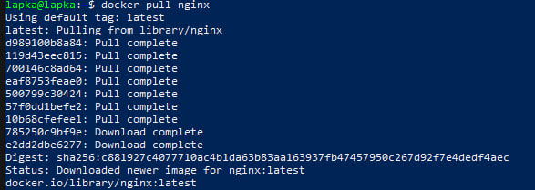
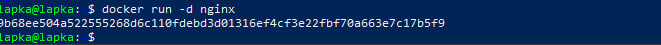
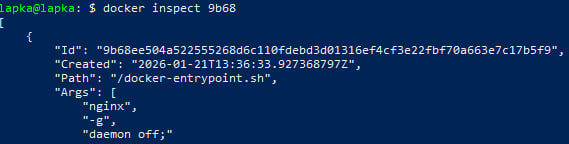
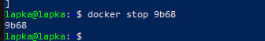

## Part 1. Готовый докер

- Пункт 1: docker pull nginx
  - Описание результата
  - Скриншот: скачивание докер-образа nginx

- Пункт 2: docker images
  - Проверка наличия докер-образа
  - Скриншот: список образов

- Пункт 3: docker run -d nginx
  - Запуск докер-контейнера
  - Скриншот: запуск докер-контейнера

- Пункт 4: docker ps
  - Проверка, что контейнер запущен
  - Скриншот: запущенный контейнер

- Пункт 5: docker inspect
  - Размер контейнера: 2290
  - IP контейнера: 172.17.0.2
  - Замапленные порты: 80/tcp: null
  - Скриншот: вывод команды `docker inspect`

  - Скриншот: информация о контейнере

- Пункт 6: docker stop
  - Остановка контейнера
  - Скриншот: остановки контейнера
    
   
- Пункт 7: docker ps
  - Проверка остановки
  - Скриншот: ввод команды `docker ps`

- Пункт 8: docker run с портами
  - Проброс портов 80 и 443, использована команда `docker run -d -p 80:80 -p 443:443 nginx`
  - Скриншот: ввод команды `docker run`

- Пункт 9: Проверка nginx в браузере
  - Адрес: http://localhost:80
  - Скриншот: стартовая страница nginx

- Пункт 10: docker restart
  - Перезапуск контейнера
  - Скриншот: ввод команды `docker restart`
    
   
- Пункт 11: Проверка запуска любым способом
  - Проверка командой `docker ps`
  - Скриншот: вывод команды `docker ps`

## Part 2. Операции с контейнером
- Пункт 1: Просмотр конфигурационного файла nginx внутри контейнера
  - Команда: `docker exec -it <container_id> cat /etc/nginx/nginx.conf`
  - Скриншот: вывод команды с содержимым nginx.conf
- Пункт 2: Создание файла nginx.conf на локальной машине
  - Создан файл nginx.conf с настройкой страницы /status
  - Скриншот: содержимое файла nginx.conf
- Пункт 3: Копирование nginx.conf в контейнер
  - Команда: `docker cp nginx.conf <container_id>:/etc/nginx/nginx.conf`
  - Скриншот: команда и её вывод
- Пункт 4: Перезапуск nginx внутри контейнера
  - Команда: `docker exec <container_id> nginx -s reload`
  - Скриншот: команда и вывод
- Пункт 5: Проверка страницы /status
  - Адрес: `http://localhost:80/status`
  - Скриншот: страница со статусом сервера nginx
- Пункт 6: Экспорт Docker-контейнера в файл
  - Экспорт Docker-контейнера в файл
  - Скриншот: создание файла container.tar
- Пункт 7: При экспорте файла была совершена ошибка
  - Ошибка: при вводе команды не было знака `>`
- Пункт 8: Была совершена остановка Docker-контейнера
  - Команда: `docker stop <container_id>`
  - Скриншот: остановка контейнера
- Пункт 9: Был создан новый контейнер
  - Команда: `docker run -d -p 80:80 --name mynginx nginx`, где было задано имя контейнеру чтобы было проще работать.
- Пункт 10: Повторяем пункт 3 и 4, где копируем файл и перезапускаем новый контейнер
  - Команда: `docker cp nginx.conf mynginx:/etc/nginx/nginx.conf` и `docker exec mynginx nginx -s reload`
  - Скриншот: команда и ее вывод
- Пункт 11: Правильный экспорт Docker-контейнера в файл, а также проверка существует ли файл
  - Команда: `docker export mynginx > container.tar` и `ls -lh container.tar`
  - Скриншот: команда и вывод
- Пункт 12: Остановка Docker-контейнера
  - Команда: `docker stop <container_id>`
  - Скриншот: остановка контейнера
- Пункт 13: Удаление образа nginx
  - Команда: `docker rmi -f nginx`, где `-f` означает что надо удалить образ в ЛЮБОМ случае
  - Скриншот: удаление образа
- Пункт 14: Удаление контейнера
  - Команда: `docker rm <container_id>`
  - Скриншот: удаление контейнера
- Пункт 15: Импорт контейнера обратно
  - Команда: `docker import container.tar nginx_imported`
  - Скриншот: импорт контейнера
- Пункт 16: Запуск импортированного контейнера
  - Команда: `docker run -d -p 80:80 nginx_imported nginx -g "daemon off;"`, где `nginx -g "daemon off;"`- говорит контейнеру запустить nginx в фоне и не выходить
  - Скриншот: запуск контейнера
- Пункт 17: Проверка страницы /status после импорта
  - Адрес: `http://localhost:80/status`
  - Скриншот: страница со статусом сервера nginx после восстановления контейнера
